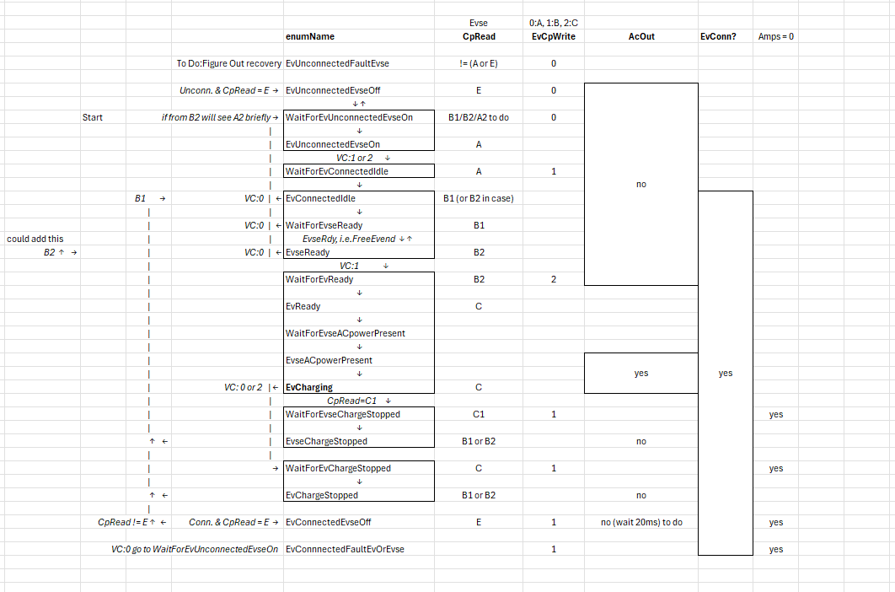
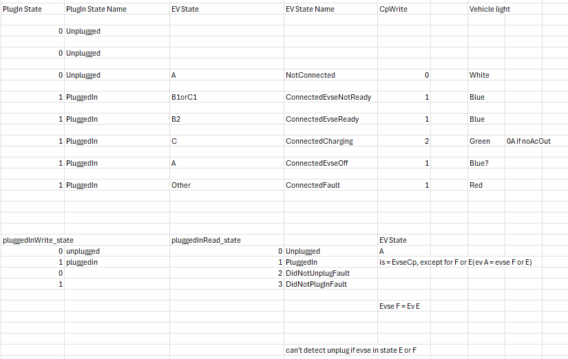
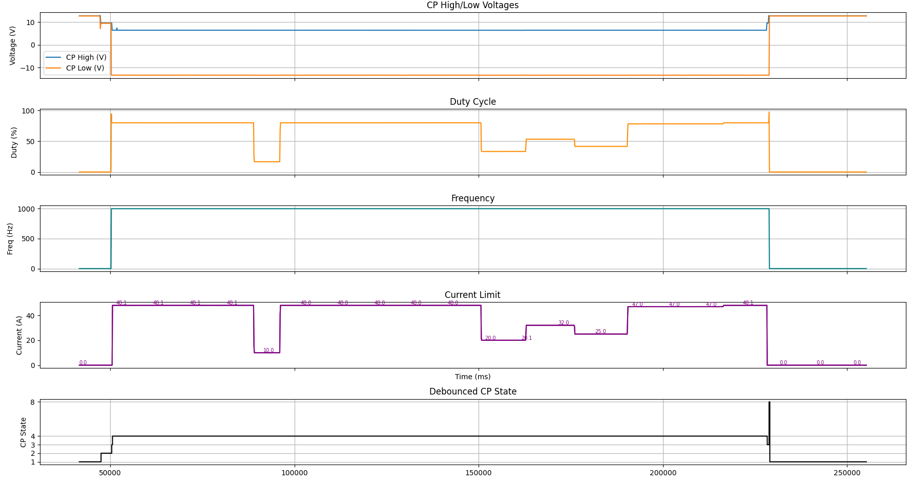
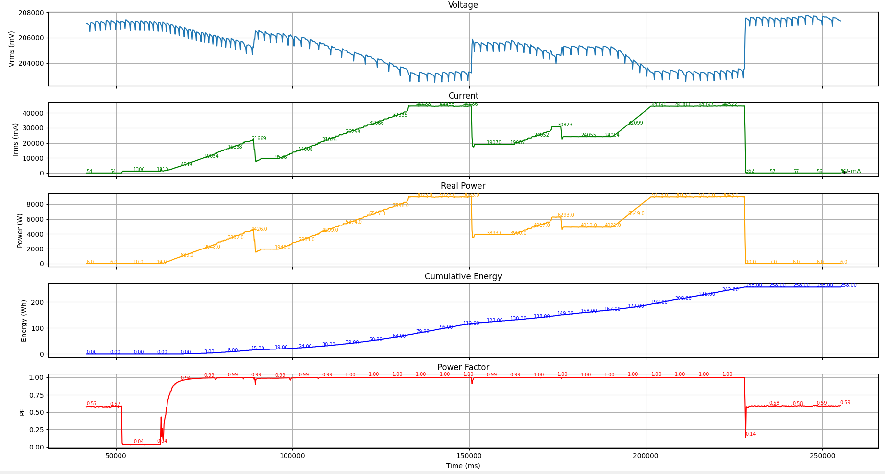

# AC_Tester STM32 Project

CubeMX HAL C project for **AC_Tester** PCB
  - Emulates CT sensor output into ADE7858 energy meter
  - Can set current and phase angle setpoints
  - J-1772 and ISO15188 comms for full vehicle emulation

## Update 8/22/25
  - Added EV side CPread, to verify that plug in relay on AC_T PCB is working
  - CPread polling speed increased, reads and processes every 10ms
    - debounced_state takes 3 consecutive states (30ms) to change
      - during sense testing, sometimes a noise spike
      - would get 1 10ms reading of B when in state C when AC out relay enabled
  - data_mode is done and well refined for both control inputs, and data outputs to a GUI on PC
    - TO DO: figure out how to implement a USB message queue on STM32, only send data when USB CDC != busy. ChatGPT given code doesn't work still after debugging

  - Working on EV_StateMachine, for automatic plug in and start charging / current follow amp limit, and fault handling
  - on V3, V1 not cover all possible states and transitions, V2 too messy and hard to follow (was buggy and didn't want to debug so started over AGAIN lol).
    - V2: 

  - V3: Work In Progress; 
    - Uses both EV and EVSE CPread state. Will use the J-1772 as the state, need to figure out timeout / delay logic
    - Will detect EVSE CP state faults, EVSE AC output faults, and AC_Tester hardware faulting (unlikely but possible)
    - Need to collect data on actual EV, record all possible state transitions and resulting state (EVSE CP and AC data)

## Update 8/14/25
  - Manual Testing Mode works!!! Set cp:1, wait for state B2/charger ready, then cp:2, wait for relay click. Set ma:32 for 32 amps

  - Energy accuracy in SENSE mode on AX80 for 50Wh: -3.13% to AX80, -1.7% to Tesco (AX is +1.3% to Tesco)
  - Current is -2.5% to AX, -1.8% to Tesco.
  - AC_T current can be calibrated via AC_I_raw_mV_per_actual_A_x1000
  - More accurate in emulation mode
  - happy with current accuracy!
  - AC data values updated every 30 cycles (500ms), can be adjusted but this is good blend of speed and noise

     - **CT emulation Accuracy Comparison:**

    | Measurement | AC_T Reading     | AX48 Reading   | % Error (AC_T vs AX48) |
    |-------------|------------------|----------------|------------------------|
    | **0A SP**   | 0                | 0           | **0, AX80 reads 0.1A tho**|
    | **10A SP**  | 9.96–9.97        | 9.90           | **+0.657%**            |
    | **20A SP**  | 19.92–19.94      | 19.80          | **+0.657%**            |
    | **48A SP**  | 47.82–47.88      | 47.6–47.7      | **+0.420%**            |
    | **Vrms**    | 241.1–241.4      | 240.5–240.7    | **+0.270%**            |
    | **Wh**      | 916.424          | 907.200        | **+1.017%**            |
    |**Watts48A** | 11.53–11.55      | 11.47–11.48    | **+0.523%**            |

    > **Note:** Positive % error means AC_T measured higher than AX48.
    AX48 ade7858 meter is calibrated at factory, likely due to resistor tolerances

    - **Sources of error**
    - Voltage resistor dividers on AC_tester have 1% tolerance, use 0.1% next time
    - CT burden resistance might be slightly higher than the 2 * 6.04 resistors used on AX48, which AX accounts / calibrates for
    - 48A watts (real power) error is ~I error + V error - pf error = +.420% +  0.270% - power factor error = 0.523% (instant V*I, if pf = 1 same as vrms*irms, if <1 power reduced)
    - Wh (energy) error is real power error + time error, still have .5% to account for. Could be that AX accounts for it's internal energy consumption

    - phase angle is offset lagging a tiny bit (ADS V SPI read time + MCP DAC ouput time)
      - current logic: read ads1220 data, process data, output MCP voltage that predicts / aligns output with next ads1220 logic
        - doesn't account for ADS V SPI read time + MCP DAC ouput time + processing time
          - MCP: 24us i2c time, 6us settle time =30us + ads1220: 5us spi read (total is 35us lag, 0.75degree, 0.99991 pF / .009% difference in power/energy)
      - AC_processor runs at 2kHz, no LPF on CT_emulator output, ade7858 runs at 8kHz with 7.2kHz LPF on inputs normally

## Hardware Overview

- **ADS1220** ADC with resistor divider:
  - For sampling AC mains voltage and waveform at 2kHz nominal
  - Also measures CT signal via ADC1_2 and 1.65V to IAP/IAN/AGND
- **MCP4725** DAC:
  - Paired with op-amps to buffer and invert signal
  - Creates a differential "fake" bipolar output centered at 1.65V to emulate CT signal
- ADC and DAC have **isolated voltage planes**
- **J-1772** EV side hardware:
  - Option to connect to external EV (for CCS board / ISO15118 comms)
- **Voltage dividers** + STM32 ADC:
  - Reads EVSE-side CP continuously
  - Reads EV-side CP (post-diode) in State B and later

---

## Software Overview (see `/Core/Src/AC_T`)

- **ADS1220 DRDY interrupt-based reads:**
  - AC_V read at 1.93kHz (1 channel), or 866Hz (2 channels)
- **Drivers and Hardware Interface:**
  - ADS + MCP drivers, high-level init/read logic
  - J-1772 controller logic
- **AC Processor:**
  - Computes Vrms, Irms, Real Power, Energy, etc.
  - Analysis based on 30-cycle chunks
  - Recreates CT signal input to ADE7858 by sampling 1 full AC wave from last buffer and replaying it
- **Control Pilot (CP) Signal Reader:**
  - 397kHz timer → triggers ADC, feeds via DMA to buffer
  - Buffer processes every ~10ms (half full)
  - CP frequency/duty may show beat/harmonics if near 40kHz
  - Determines:
    - Actual CP state (with debouncing: needs 2+ cycles to switch)
    - Current limit in amps when in state C
    - `isPLC` (powerline communication detected)
  - Tolerant CP state detection: ±2% DC duty allowed per J-1772, +-1V for B, C... states, current code has +-1.5V so not undefined at 7.5V for example
  - **Hardware Accuracy Comparison:**

    | State | AC_T Read (V) | Scope Measured (V) |
    |-------|---------------|---------------------|
    | A     | 12.23         | 11.5                |
    | B     | 8.79          | 8.72                |
    | C     | 5.37          | 5.62                |
    | PWM Low | -13.47      | -11.61              |

    Frequency and DC is plenty accurate now

- **AC_Tester Modes:**
  - USB CDC communication via `/USB_DEVICE/App/usbd_cdc_if.c`
  - Works over any baud rate
  - Accepts serial commands:
    - Change CP state
    - Set data mode, sample rate
    - Responds with telemetry data

---

## To-Do / Roadmap

- [X] **Add CP states:**
  - State 9: Unplug CP without going to state B2 first +6V (so +-12V pwm state for a few secs after unplug)
  - State 10: State C2 (go from A to C skipping B or C to B) +-12V, state 9 and 10 might be the same
- [X] **Emulate CT signal**:
  - Save 1 AC waveform cycle, loop output via DAC
  - Use global setpoint for current amplitude and phase angle
- [X] **Expand AC_Tester_modes:**
  - Full serial control interface (see Excel reference)
  - Periodic USB output (100–1000ms)
  - Optimize with ring buffer, check `USB != busy`
- [ ] **Vehicle Profile Emulation:**
  - Plug-in triggers B1
  - Wait for B2, then enter C
  - Ramp to target current
  - Handle unplug logic
- [X] **Detect charger AC output (optocoupler):**
  - Validate AC relay output is live (vehicle actually getting AC power in)
- [x] **Improve energy metering accuracy:**
  - Current code output vs AX80 (258Wh vs. 266.3Wh)
  - Sample AX80 via Modbus at 100ms intervals
  - Account for:
    - Time drift (~2s/day on STM32) insignificant
    - Int math truncation in uW/mV conversion
    - Sampling rate mismatch (AX80 = 8kHz, STM32 = 866Hz) if no high freq. noise should be fine
  - Verify ADS DRDY interrupt timing stability (numSamples is stable) and not impacted by CPU being busy 
  - Calibrate to Tesco/AX80 values
- [ ] **Integrate FOCCI/CLARA CCS Board:**
  - For ISO15118 / AutoCharge testing

F150 Test Data from sense mode:

---